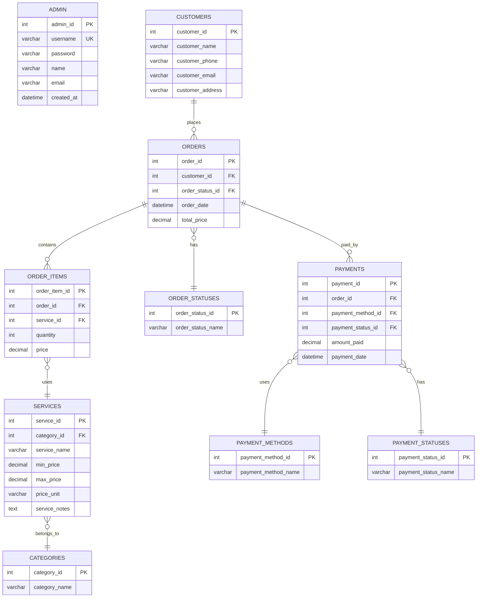

# La Lavandera - Laundry Monitoring and Services System

## Introduction

The **La Lavandera Laundry Monitoring and Services System** is a desktop application built with Python and PyQt6, featuring a MySQL backend. It streamlines laundry shop operations by enabling administrators to manage orders, payments, and customer information efficiently, while allowing clients to conveniently track their laundry status using a unique Order ID.

---
## 📋 Project Revisions (Based on Panel Feedback)

### Panel Recommendation: "Apply more OOP concepts"

In response to panel feedback, I implemented the four pillars of Object-Oriented Programming:

#### 1. **Encapsulation**
- **Customer Class** (`models/customer_class.py`)
  - Groups customer data and methods together
  - Uses `@classmethod` for `get_by_id()` and `get_all()`
  - Provides `save()` and `delete()` methods

#### 2. **Inheritance**
- **Payment Status Classes** (`models/status_factory.py`)
  - Base `PaymentStatus` class
  - Child classes: `PaidStatus`, `PendingStatus`, `PartialStatus`, `RefundedStatus`, `FailedStatus`
  - Each inherits from the base class

#### 3. **Polymorphism**
- **Payment Status Behavior**
  - Same method names (`get_payment_date()`, `get_amount_paid()`) work differently for each status
  - `PaidStatus.get_payment_date()` returns current date
  - `PendingStatus.get_payment_date()` returns None

#### 4. **Abstraction**
- **Validator Classes** (`models/order_validator.py`)
  - Hides complex validation logic
  - Simple method calls like `validate_customer_info()` and `validate_order_items()`
  - Business rules are hidden from the GUI
---

## Problem Statement

Local laundry shops often rely on manual, paper-based processes for managing orders, receipts, and payments. This results in:

- Misplaced orders and lost paperwork
- Inaccurate time estimates for completion
- Billing errors and payment disputes
- Inefficient record-keeping for both business owners and clients
- Difficulty tracking order status in real-time

---

## Target Users

- **Laundry shop owners and staff** - Full admin access for comprehensive order and customer management
- **Laundry shop clients** - Self-service order tracking and status inquiry
- **Walk-in customers** - Service information browsing and pricing details

---

## Features

### Admin Features

- **Secure Authentication System** - Password-protected admin login
- **Comprehensive Order Management** - Create, view, update, and delete orders
- **Real-time Order Tracking** - Monitor order status from pending to completed
- **Customer Information Management** - Store and manage customer details
- **Payment Processing** - Track payments with multiple methods (Cash, Card, E-Wallet, Bank Transfer)
- **Payment Status Management** - Handle pending, partial, paid, failed, and refunded payments
- **Order Status Workflow** - Manage orders through stages: Pending Payment → Queueing → Washing/Cleaning → Finishing Up → Ready for Pickup → Completed
- **Auto-refund on Cancellation** - Automatically handle refunds when orders are cancelled
- **Service Catalog** - View all available services grouped by category

### Customer Features

- **Order Tracking Interface** - Track laundry status using Order ID
- **Order Details View** - See complete order information including items and pricing
- **Payment Information** - View payment status and amount paid
- **Service Price List** - Browse available services and pricing

### System Features

- **Data Validation** - Comprehensive validation for customer info, orders, and payments
- **Business Logic Enforcement** - Automatic status updates based on payment
- **Database Integrity** - Cascading deletes and referential integrity
- **Professional UI** - Clean, modern interface with custom styling
- **Responsive Design** - Intuitive navigation and user feedback

---
## 🎓 OOP Concepts Applied

### 1. **Encapsulation**

Grouping related data and methods together in a class.

- **Customer Class**: Keeps customer data and operations in one place

  ```python
  class Customer:
      def __init__(self, customer_id, name, phone, email, address):
          self.customer_id = customer_id
          self.name = name
          self.phone = phone
          # ... other attributes

      def save(self):
          # Save customer to database

      def delete(self):
          # Delete customer from database
  ```

- **Database Connection**: Manages database connections safely
  ```python
  @contextmanager
  def db_cursor(conn, dictionary=True):
      cursor = conn.cursor(dictionary=dictionary)
      try:
          yield cursor
      finally:
          cursor.close()
  ```

### 2. **Inheritance**

Creating child classes that inherit properties and methods from a parent class.

- **Payment Status Classes**: Child classes inherit from base PaymentStatus class

  ```python
  class PaymentStatus:  # Parent class
      def get_payment_date(self):
          return None

  class PaidStatus(PaymentStatus):  # Child class
      def get_payment_date(self):
          return datetime.now()

  class PendingStatus(PaymentStatus):  # Another child class
      def get_payment_date(self):
          return None
  ```

### 3. **Polymorphism**

Same method name behaves differently for different classes.

- **Different Payment Status Behaviors**: Same method, different results

  ```python
  # Same method name, different behavior
  paid_status = PaidStatus()
  paid_status.get_payment_date()  # Returns datetime.now()

  pending_status = PendingStatus()
  pending_status.get_payment_date()  # Returns None

  refunded_status = RefundedStatus()
  refunded_status.get_amount_paid(1000)  # Returns 0
  ```

### 4. **Abstraction**

Hiding complex logic behind simple method calls.

- **Validator Classes**: Complex validation hidden behind simple methods

  ```python
  class OrderValidator:
      def validate_customer_info(self, name, phone, email, address):
          # Complex validation logic hidden here
          # User just calls the method

      def validate_order_items(self, items):
          # Business rules hidden from caller
  ```

- **Payment Processor**: Hides calculation details
  ```python
  class PaymentProcessor:
      @staticmethod
      def calculate_total(order_items):
          # Calculation logic hidden

      @staticmethod
      def determine_payment_status(amount_paid, total_price):
          # Decision logic hidden
  ```

---

## Database Overview

### Database Schema

**Core Tables:**

- **`admin`** - Staff authentication and credentials
- **`customers`** - Customer personal information
- **`orders`** - Order records with status and totals
- **`order_items`** - Individual services per order
- **`payments`** - Payment transactions and records

**Reference Tables:**

- **`categories`** - Service groupings (Standard, Specialized, Dry Cleaning, Add Ons)
- **`services`** - Available laundry services with pricing
- **`order_statuses`** - Order workflow stages
- **`payment_statuses`** - Payment states (Pending, Partial, Paid, Failed, Refunded)
- **`payment_methods`** - Payment options (Cash, Card, E-Wallet, Bank Transfer)

### Service Categories

1. **Standard** - Machine Wash & Dry, Hand Wash & Dry
2. **Specialized** - Carpet, Comforter, Bedsheets, Stuffed Toys
3. **Dry Cleaning** - Barong, Blouse, Pants, Jacket, Suits, Gowns
4. **Add Ons** - Express Service, Delivery, Folding, Pressing, Stain Removal

---

## Entity-Relationship Diagram


---

## Technologies Used

- **Python 3.8+** - Core application development and business logic
- **PyQt6** - Modern cross-platform GUI framework
- **MySQL 8.0** - Relational database management system
- **mysql-connector-python** - Python MySQL database adapter
- **XAMPP** - Local development environment (Apache + MySQL)
- **Decimal** - Precise monetary calculations

---
## 🧺 Project Structure

```
LaundrySystem/
├── src/
│   ├── db/                              # 🗄️ Database Layer
│   │   ├── __init__.py                  # Package marker
│   │   ├── connection.py                # Database connection & context manager
│   │   └── db_laundry.sql               # Database schema & initial data
│   │
│   ├── gui/                             # 🖥️ User Interface Layer
│   │   ├── __init__.py                  # Package marker
│   │   ├── main_window.py               # Main application window & entry point
│   │   ├── login_page.py                # Admin authentication dialog
│   │   ├── admin_page.py                # Order management interface (main admin view)
│   │   ├── order_form_page.py           # Add/Edit order dialog with validation
│   │   ├── track_order_page.py          # Customer order tracking interface
│   │   ├── services_page.py             # Service catalog display
│   │   ├── a_logo.png                   # Application icon (16x16, 32x32)
│   │   └── a_main_logo.png              # Main logo banner image
│   │
│   └── models/                          # 📊 Business Logic & Data Layer
│       ├── __init__.py                  # Package marker
│       ├── admin.py                     # Admin authentication CRUD
│       ├── customer_class.py            # Customer class with OOP methods
│       ├── order.py                     # Order CRUD operations
│       ├── order_item.py                # Order items management
│       ├── order_status.py              # Order status CRUD
│       ├── order_validator.py           # Business logic validators (OOP)
│       ├── service.py                   # Service catalog CRUD
│       ├── category.py                  # Service categories CRUD
│       ├── payment.py                   # Payment CRUD operations
│       ├── payment_method.py            # Payment methods CRUD
│       ├── payment_status.py            # Payment status CRUD
│       └── status_factory.py            # Factory pattern for payment status (OOP)
│
├── .gitignore                           # Git ignore rules
└── README.md                            # Project documentation
```

---

## Usage Guide

### For Administrators

1. **Login:**

   - Launch application
   - Click "Admin Log In" button
   - Enter credentials (username: `labandera`, password: `labandera_admin`)

2. **Add New Order:**

   - Click "Add Order" button
   - Fill in customer information
   - Select services and quantities
   - Adjust prices if needed (within min-max range)
   - Enter payment details
   - Click "Add Order" to save

3. **Manage Orders:**

   - View all orders in the main table
   - Click on an order to view details in side panels
   - Update payment status from dropdown
   - Update order status through workflow
   - Delete orders using "Delete Order" button

4. **Payment Management:**

   - Edit amount paid directly in the detail panel
   - System auto-determines payment status (Pending/Partial/Paid)
   - Payment status can be manually adjusted if needed
   - Completed payments automatically update order status

5. **Order Status Workflow:**
   - Pending Payment → Queueing (auto when paid)
   - Queueing → Washing/Cleaning
   - Washing/Cleaning → Finishing Up
   - Finishing Up → Ready for Pickup/Delivery
   - Ready for Pickup/Delivery → Completed
   - Any status → Cancelled (triggers auto-refund)

### For Customers

1. **Track Order:**

   - Enter Order ID in search box on main page
   - Click search button
   - View order status and details

2. **View Services:**
   - Click "Services" button
   - Browse available services by category
   - View pricing ranges

---

## Business Rules & Validation

### Payment Validation

- Amount paid cannot be negative
- "Paid" status requires full payment
- Partial payment automatically sets "Partial" status
- Zero payment sets "Pending" status

### Order Status Rules

- Orders cannot progress without payment started
- "Completed" requires full payment
- "Cancelled" triggers automatic refund
- Status transitions follow logical workflow

### Order Item Validation

- At least one service must be selected
- Quantities must be positive
- Prices must be within service min-max range

### Customer Validation

- Name and contact number are required

---

## Features Highlight

### Automatic Business Logic

- **Auto Payment Status**: System determines status based on amount paid
- **Auto Order Status**: Payment completion triggers order status update
- **Auto Refund**: Cancellation automatically sets payment to ₱0 and "Refunded"
- **Auto Date Tracking**: Payment date recorded when fully paid

### Data Integrity

- **Cascading Deletes**: Deleting order removes items and payments
- **Customer Cleanup**: Customers deleted when no orders remain
- **Referential Integrity**: Foreign keys maintain data consistency

### User Experience

- **Confirmation Dialogs**: Critical actions require confirmation
- **Real-time Updates**: Changes reflect immediately in interface
- **Visual Feedback**: Status-based colors and formatting
- **Input Validation**: Prevents invalid data entry

---

## Known Limitations

1. **Password Security**: Passwords stored in plain text (academic project)
2. **Single Admin Session**: No multi-user concurrent access handling
3. **No Backup Feature**: Manual database backup required
4. **Local Database**: Requires local MySQL server

---

## Future Enhancements

- Password hashing for security
- SMS/Email notifications for order status
- Reporting and analytics dashboard
- Inventory management integration
- Mobile application for customers
- Cloud database support
- Multi-branch management

---

## Screenshots


---

## License

This project is developed for academic purposes as part of IT5 course requirement.

---

## Author

**Arianne Danielle V. Añora**  
BS Information Technology
University of Mindanao  
Date: October 2025

_Last Updated: October 15, 2025_
