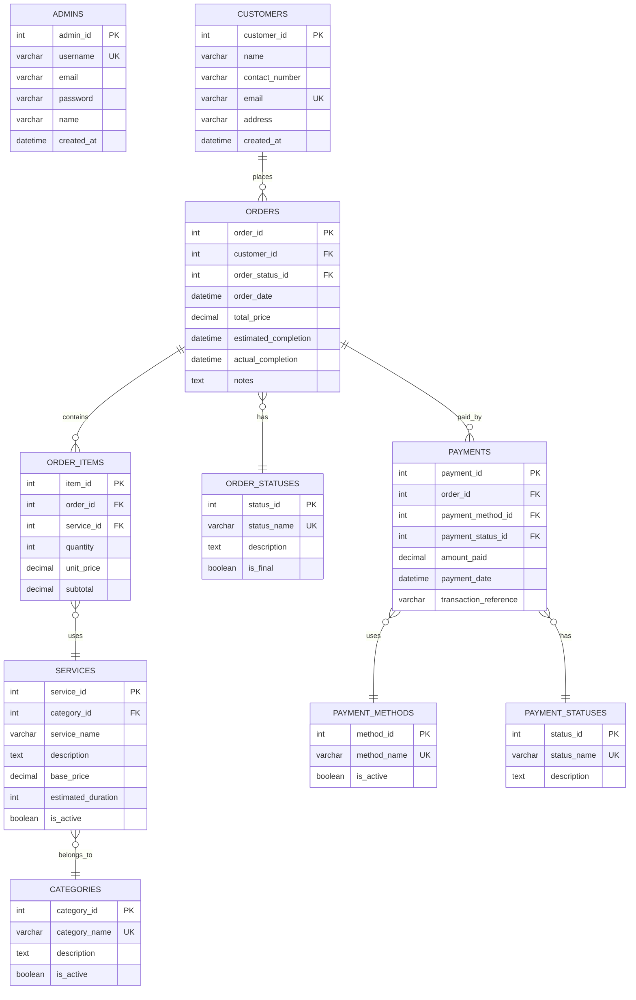

# Laundry Monitoring and Services System

## Introduction

The **Laundry Monitoring and Services System** is a Python application (desktop GUI or web) with a MySQL (XAMPP) backend. It streamlines laundry shop operations by enabling administrators to manage orders efficiently and allowing clients to conveniently track their laundry status using a unique Order ID.

---

## Problem Statement

Local laundry shops often rely on manual, paper-based processes for managing orders, receipts, and payments. This results in misplaced orders, inaccurate time estimates, billing errors, and inefficient record-keeping for both business owners and clients.

---

## Target Users

- **Laundry shop owners and staff** - Full admin access for order management
- **Laundry shop clients** - Order tracking and status inquiry
- **Walk-in customers** - Service information and order placement

---

## Features

- **Admin Authentication System** - Secure login for staff access
- **Order Management Interface** - View, delete, and refresh orders with real-time data
- **Database Integration** - Full CRUD operations with MySQL backend
- **Professional GUI** - Clean, user-friendly PyQt6 interface with custom styling
- **Real-time Order Display** - Table view showing order details, dates, and pricing
- **Window Navigation** - Seamless transitions between main, login, and admin windows
- **Customer Order Tracking** - Client interface for checking order status
- **Order Creation System** - Add new orders through GUI forms
- **Payment Management** - Payment processing and tracking

---

## Database Overview

**Entities:**

- `admins`: Admin/staff login credentials and info
- `customers`: Customer details
- `orders`: Orders placed, linked to customers
- `order_items`: Services/add-ons per order
- `payments`: Payment records per order
- `categories`: Service categories
- `services`: Service items and add-ons
- `order_statuses`: Progress tracking for orders
- `payment_statuses`: Status of payments
- `payment_methods`: Modes of payment

**Entity Relationships Diagram:**

```
[admins]


[customers]----< [orders] >----[order_statuses]
       |                        |
       |                        v
       |                  [order_items] >----[services]----[categories]
       |                                                      ^
       |                                                      |
       |                                             [payments]----[payment_statuses]
       |                                                      |
       |                                                      v
       |                                      [payment_methods]
```

---

## 🧩 Class Diagram

```mermaid
classDiagram
    %% Database Connection Classes
    class DatabaseConnection {
        +get_db_connection() Connection
        +db_cursor(conn, dictionary) ContextManager
        +test_connection() bool
    }

    %% Model Classes
    class Admin {
        +admin_id: int
        +username: string
        +email: string
        +password: string
        +name: string
        +created_at: datetime
        +add_admin(username, email, password, created_at, name) int
        +get_admin_by_id(admin_id) Admin
        +authenticate_admin(username, password) bool
        +update_admin(admin_id, **kwargs) bool
        +delete_admin(admin_id) bool
    }

    class Customer {
        +customer_id: int
        +name: string
        +contact_number: string
        +email: string
        +address: string
        +created_at: datetime
        +add_customer(name, contact, email, address) int
        +get_customer_by_id(customer_id) Customer
        +get_all_customers() List~Customer~
        +update_customer(customer_id, **kwargs) bool
        +delete_customer(customer_id) bool
        +search_customers(query) List~Customer~
    }

    class Order {
        +order_id: int
        +customer_id: int
        +order_status_id: int
        +order_date: datetime
        +total_price: decimal
        +estimated_completion: datetime
        +actual_completion: datetime
        +notes: string
        +add_order(customer_id, status_id, date, total) int
        +get_order_by_id(order_id) Order
        +get_all_orders() List~Order~
        +update_order(order_id, **kwargs) bool
        +delete_order(order_id) bool
        +get_orders_by_customer(customer_id) List~Order~
        +get_orders_by_status(status_id) List~Order~
    }

    class OrderItem {
        +item_id: int
        +order_id: int
        +service_id: int
        +quantity: int
        +unit_price: decimal
        +subtotal: decimal
        +add_order_item(order_id, service_id, qty, price) int
        +get_items_by_order(order_id) List~OrderItem~
        +update_order_item(item_id, **kwargs) bool
        +delete_order_item(item_id) bool
        +calculate_subtotal() decimal
    }

    class Service {
        +service_id: int
        +category_id: int
        +service_name: string
        +description: string
        +base_price: decimal
        +estimated_duration: int
        +is_active: bool
        +add_service(category_id, name, desc, price, duration) int
        +get_service_by_id(service_id) Service
        +get_services_by_category(category_id) List~Service~
        +get_all_active_services() List~Service~
        +update_service(service_id, **kwargs) bool
        +deactivate_service(service_id) bool
    }

    class Category {
        +category_id: int
        +category_name: string
        +description: string
        +is_active: bool
        +add_category(name, description) int
        +get_category_by_id(category_id) Category
        +get_all_active_categories() List~Category~
        +update_category(category_id, **kwargs) bool
        +deactivate_category(category_id) bool
    }

    class OrderStatus {
        +status_id: int
        +status_name: string
        +description: string
        +is_final: bool
        +add_status(name, description, is_final) int
        +get_status_by_id(status_id) OrderStatus
        +get_all_statuses() List~OrderStatus~
        +update_status(status_id, **kwargs) bool
    }

    class Payment {
        +payment_id: int
        +order_id: int
        +payment_method_id: int
        +payment_status_id: int
        +amount_paid: decimal
        +payment_date: datetime
        +transaction_reference: string
        +add_payment(order_id, method_id, amount) int
        +get_payments_by_order(order_id) List~Payment~
        +update_payment_status(payment_id, status_id) bool
        +get_payment_by_id(payment_id) Payment
    }

    class PaymentMethod {
        +method_id: int
        +method_name: string
        +is_active: bool
        +add_payment_method(name) int
        +get_all_active_methods() List~PaymentMethod~
        +update_method(method_id, **kwargs) bool
    }

    class PaymentStatus {
        +status_id: int
        +status_name: string
        +description: string
        +add_payment_status(name, description) int
        +get_all_payment_statuses() List~PaymentStatus~
    }

    %% GUI Classes
    class MainWindow {
        +title: string
        +geometry: tuple
        +admin_window: AdminWindow
        +customer_window: CustomerWindow
        +initUI() void
        +show_admin_login() void
        +show_customer_tracking() void
        +show_services_info() void
        +exit_application() void
    }

    class LoginDialog {
        +username_field: QLineEdit
        +password_field: QLineEdit
        +login_button: QPushButton
        +cancel_button: QPushButton
        +initUI() void
        +validate_credentials() bool
        +on_login_success() void
        +on_login_failure() void
    }

    class AdminWindow {
        +orders_table: QTableView
        +customers_table: QTableView
        +table_model: OrdersTableModel
        +back_button: QPushButton
        +refresh_button: QPushButton
        +add_button: QPushButton
        +delete_button: QPushButton
        +initUI() void
        +load_orders_data() void
        +refresh_orders() void
        +add_new_order() void
        +delete_selected_order() void
        +show_order_details() void
        +back_to_main() void
    }

    class OrdersTableModel {
        +headers: List~string~
        +data: List~List~
        +rowCount(parent) int
        +columnCount(parent) int
        +data(index, role) QVariant
        +headerData(section, orientation, role) QVariant
        +refresh_data() void
        +convert_data(raw_data) List~List~
        +get_order_id(row) int
    }

    class CustomerWindow {
        +order_id_field: QLineEdit
        +search_button: QPushButton
        +status_display: QLabel
        +details_table: QTableWidget
        +initUI() void
        +search_order() void
        +display_order_status() void
        +display_order_details() void
        +clear_results() void
    }

    class OrderDialog {
        +customer_combo: QComboBox
        +services_list: QListWidget
        +total_label: QLabel
        +save_button: QPushButton
        +cancel_button: QPushButton
        +selected_services: List~Service~
        +initUI() void
        +load_customers() void
        +load_services() void
        +add_service_to_order() void
        +calculate_total() decimal
        +save_order() bool
    }

    %% Relationships
    Customer ||--o{ Order : "places"
    Order ||--o{ OrderItem : "contains"
    Order }o--|| OrderStatus : "has"
    Order ||--o{ Payment : "paid_by"

    OrderItem }o--|| Service : "uses"
    Service }o--|| Category : "belongs_to"

    Payment }o--|| PaymentMethod : "uses"
    Payment }o--|| PaymentStatus : "has"

    %% GUI Relationships
    MainWindow --> LoginDialog : "opens"
    MainWindow --> AdminWindow : "opens"
    MainWindow --> CustomerWindow : "opens"

    AdminWindow --> OrdersTableModel : "uses"
    AdminWindow --> OrderDialog : "opens"

    %% Database Connections (All models use DatabaseConnection)
    Admin --> DatabaseConnection : "uses"
    Customer --> DatabaseConnection : "uses"
    Order --> DatabaseConnection : "uses"
    OrderItem --> DatabaseConnection : "uses"
    Service --> DatabaseConnection : "uses"
    Category --> DatabaseConnection : "uses"
    OrderStatus --> DatabaseConnection : "uses"
    Payment --> DatabaseConnection : "uses"
    PaymentMethod --> DatabaseConnection : "uses"
    PaymentStatus --> DatabaseConnection : "uses"
```

## 🧩 Use Case Diagram

```mermaid
usecaseDiagram
    actor Admin as A
    actor Customer as C

    rectangle "La Lavandera: Laundry Monitoring & Services System" {
        (Login) as UC1
        (Add Laundry Order) as UC2
        (Update Laundry Status) as UC3
        (Update Payment Status) as UC4
        (View All Orders) as UC5
        (Delete or Update Orders) as UC6
        (Track Order Status) as UC7
        (View Services and Prices) as UC8
    }

    A --> UC1
    A --> UC2
    A --> UC3
    A --> UC4
    A --> UC5
    A --> UC6

    C --> UC7
    C --> UC8

```



```mermaid
graph TB
    %% Actors
    Admin[👨‍💼 Admin/Staff]
    Customer[👤 Customer]
    SystemActor[🖥️ Automated System Functions]

    %% System Boundary
    subgraph LMS [📚 Library Management System]
        %% Admin Use Cases
        UC1[Login to System]
        UC2[Manage Orders]
        UC3[Manage Customers]
        UC4[Process Payments]
        UC6[Manage Services]

        %% Customer Use Cases
        UC7[Track Order Status]
        UC8[View Order Details]
        UC9[Check Service Prices]

        %% System Use Cases
        UC11[Calculate Pricing]
        UC12[Update Order Status]
        UC13[Backup Data]

        %% Sub Use Cases for Order Management
        UC2 --> UC2A[Create New Order]
        UC2 --> UC2B[View All Orders]
        UC2 --> UC2C[Update Order Status]
        UC2 --> UC2D[Delete Order]
        UC2 --> UC2E[Search Orders]

        %% Sub Use Cases for Customer Management
        UC3 --> UC3A[Add New Customer]
        UC3 --> UC3B[View Customer Details]
        UC3 --> UC3C[Update Customer Info]
        UC3 --> UC3D[Search Customers]

        %% Sub Use Case for Payment Processing
        UC4 --> UC4D[Generate Receipt]

        %% Include Relation Example
        UC2A -->|includes| UC4D
    end

    %% Connections
    Admin --> UC1
    Admin --> UC2
    Admin --> UC3
    Admin --> UC4
    Admin --> UC6

    Customer --> UC7
    Customer --> UC8
    Customer --> UC9

    SystemActor --> UC11
    SystemActor --> UC12
    SystemActor --> UC13
```

## 🔄 Sequence Diagram – Add Order Flow


## 🗃️ Entity–Relationship Diagram



## Technologies Used

- **Python 3.8+** - Core application development
- **PyQt6** - Modern desktop GUI framework
- **MySQL** - Database management (via XAMPP)
- **mysql-connector-python** - Database connectivity
- **VS Code** - Development environment with Python extensions

---

## 📁 Current Project Structure

```
LaundrySystem/
├── src/
│   ├── db/                              # 🗄️ Database Layer
│   │   ├── __init__.py                  # Package marker
│   │   └── connection.py                # Database connection & cursor management
│   │
│   ├── models/                          # 📊 Business Logic Layer
│   │   ├── __init__.py                  # Package marker
│   │   ├── admin.py                     # Admin authentication & management
│   │   ├── customer.py                  # Customer data operations
│   │   ├── order.py                     # Order CRUD operations
│   │   ├── order_item.py               # Order items management
│   │   ├── service.py                  # Service catalog management
│   │   ├── category.py                 # Service categories
│   │   ├── payment.py                  # Payment processing
│   │   └── status.py                   # Order & payment status tracking
│   │
│   ├── gui/                            # 🖥️ User Interface Layer
│   │   ├── __init__.py                 # Package marker
│   │   ├── main_window.py              # Main application window & navigation
│   │   ├── login_page.py               # Admin authentication dialog
│   │   ├── admin_page.py               # Order management interface
│   │   ├── customer_window.py          # Customer order tracking (planned)
│   │   ├── order_dialog.py             # Add/Edit order forms (planned)
│   │   ├── a_logo.png                  # Application icon
│   │   └── a_main_logo.png             # Main logo image
│   │
│   └── tests/                          # 🧪 Testing & Verification
│       ├── __init__.py                 # Package marker
│       ├── test_db_connection.py       # Database connectivity tests
│       ├── verify_order.py             # Order functionality verification
│       ├── test_orders.py              # Order data validation
│       └── test_models.py              # Model unit tests (planned)
│
├── .venv/                              # Virtual environment
│   └── Lib/site-packages/
│       └── laundry_src.pth             # Python path configuration
│
├── .env                                # Environment variables
├── .gitignore                          # Git ignore rules
└── README.md                           # Project documentation
```

---

## Screenshots

---

## Author

Arianne Danielle V. Añora
